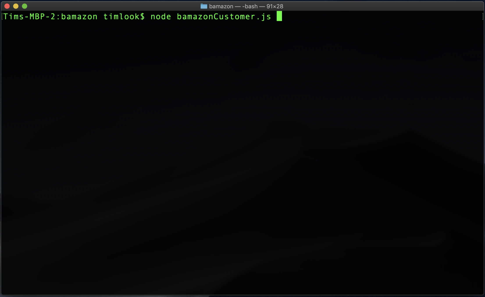
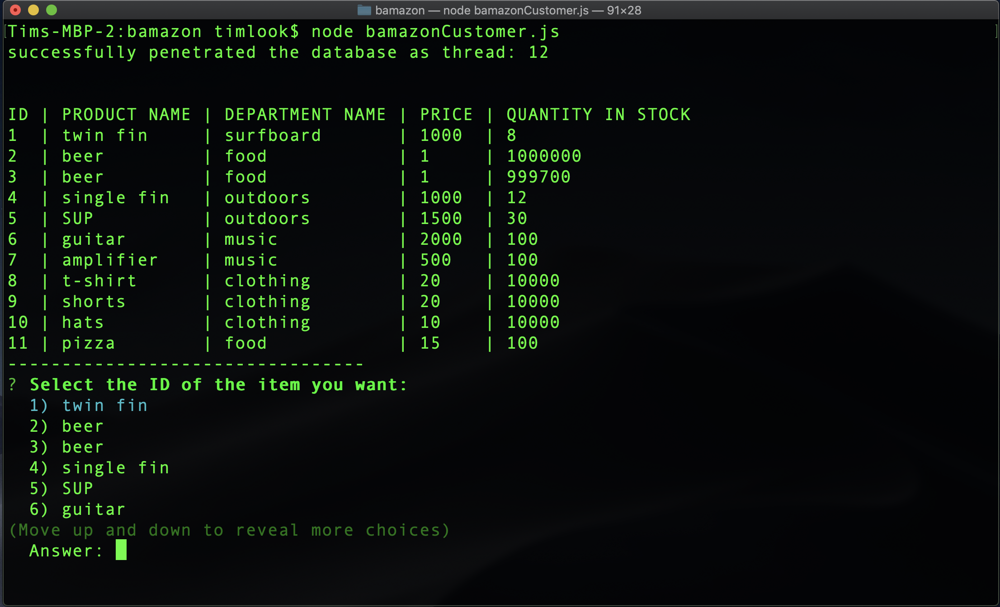
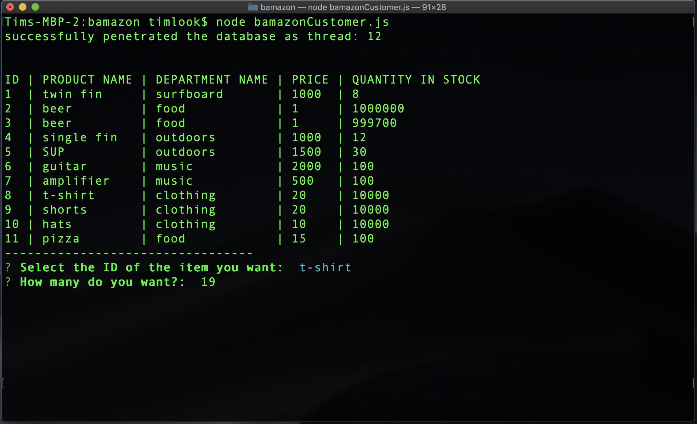

# BAMAZON :)

### Overview

The MVP objective of this activity, was to create an Amazon-like storefront with the MySQL skills I learned in this unit. The app will take in orders from customers and deplete stock from the store's inventory.

### Instructions:

1. Load the `bamazon.sql` script into your own local database (i.e. mysql)
2. Add your own password to the password variable in the `bamazonCustomer.js` file.
3. Don't forget to install in the necessary dependcies in your project root folder. Reference the `package.json` file. And since I am so nice I also included it as a reminder in the comments at top of the `bamazonCustomer.js`

4. Launch the Bamazon program in the CLI from the root folder of the project using the command: `node bamazonCustomer.js`

### Now for the Good Stuff.....

The MVP functionality includes the following:

  1. Display all of the items available for sale. Including the ids, names, and prices of products for sale.

  

  2. Prompt users with two messages:

    * The first should ask them the ID of the product they would like to buy.
    * The second message should ask how many units of the product they would like to buy.

  

  3. Once the customer has placed the order, your application should check if your store has enough of the product to meet the customer's request.

    * If not, the app should log a phrase like `Insufficient quantity!`, and then prevent the order from going through.

  4. If your store _does_ have enough of the product, you should fulfill the customer's order.

   * This means updating the SQL database to reflect the remaining quantity.

   * Once the update goes through, show the customer the total cost of their purchase.

  

### Additional tasks for future builds include:

  1. Tracking product sales across the store's departments.

  2. Providing a summary of the highest-grossing departments in the store.